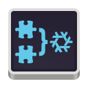

<div align="center">



# Xinux Module Manager

[![Built with Nix][builtwithnix badge]][builtwithnix]
[![License: GPLv3][GPLv3 badge]][GPLv3]
[![Chat on Matrix][matrix badge]][matrix]
[![Chat on Discord][discord badge]][discord]

A simple Xinux module manager application built with [libadwaita](https://gitlab.gnome.org/GNOME/libadwaita), [GTK4](https://www.gtk.org/), and [Relm4](https://relm4.org/). The goal of this project is to provide a simple graphical tool for modifying and managing desktop NixOS configurations.


</div>

## NixOS Flakes Installation

`flake.nix`

```nix
{
  inputs = {
    # other inputs
    xinux-module-manager.url = "github:xinux-org/module-manager";
    # rest of flake.nix
```

`configuration.nix`

```nix
environment.systemPackages = with pkgs; [
    xinux-module-manager.packages.${system}.xinux-module-manager
    # rest of your packages
];
```

## NixOS Installation

Head of `configuration.nix`

if you are on unstable channel or any version after 22.11:

```nix
{ config, pkgs, lib, ... }:
let
  xinux-module-manager = import (pkgs.fetchFromGitHub {
    owner = "xinux-org";
    repo = "module-manager";
    sha256 = "sha256-/10428f0b93fd9c77284b0cd9b193a924c10bb7a4";
  }) {};
in
```

Packages:

```nix
environment.systemPackages =
with pkgs; [
  xinux-module-manager
  # rest of your packages
];
```

For any other method of installation, when rebuilding you will be prompted to authenticate twice in a row

## 'nix profile' installation

```bash
nix profile install github:xinux-org/module-manager
```

## 'nix-env' Installation

```bash
git clone https://github.com/xinux-org/module-manager
nix-env -f xinux-module-manager -i xinux-module-manager
```

## Single run on an flakes enabled system:

```bash
nix run github:xinux-org/module-manager
```

## Single run on non-flakes enabled system:

```bash
nix --extra-experimental-features "nix-command flakes" run github:xinux-org/module-manager
```

## Debugging

```bash
RUST_LOG=nixos_conf_editor=trace xinux-module-manager
```

# Screenshots

<p align="middle">
  
  
</p>

<p align="middle">
  
  
</p>

<p align="middle">
  
  
</p>

<p align="middle">
  
  
</p>

<p align="middle">
  
  
</p>

## Licenses

The icons in [data/icons](data/icons/) contains assets from the [NixOS logo](https://github.com/NixOS/nixos-artwork/tree/master/logo) and are licensed under a [CC-BY license](https://creativecommons.org/licenses/by/4.0/).

[builtwithnix badge]: https://img.shields.io/badge/Built%20With-Nix-41439A?style=for-the-badge&logo=nixos&logoColor=white
[builtwithnix]: https://builtwithnix.org/
[GPLv3 badge]: https://img.shields.io/badge/License-GPLv3-blue.svg?style=for-the-badge
[GPLv3]: https://opensource.org/licenses/GPL-3.0
[matrix badge]: https://img.shields.io/badge/matrix-join%20chat-0cbc8c?style=for-the-badge&logo=matrix&logoColor=white
[matrix]: https://matrix.to/#/#snowflakeos:matrix.org
[discord badge]: https://img.shields.io/discord/1021080090676842506?color=7289da&label=Discord&logo=discord&logoColor=ffffff&style=for-the-badge
[discord]: https://discord.gg/6rWNMmdkgT
